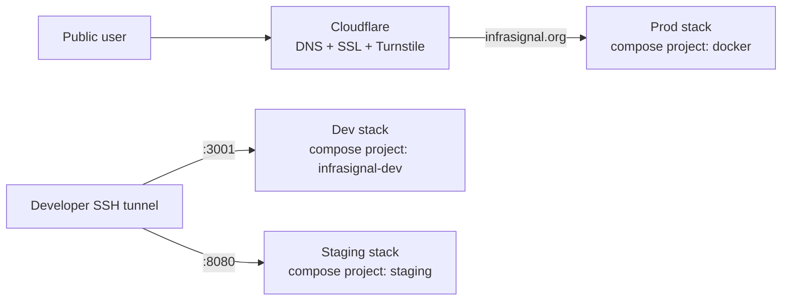
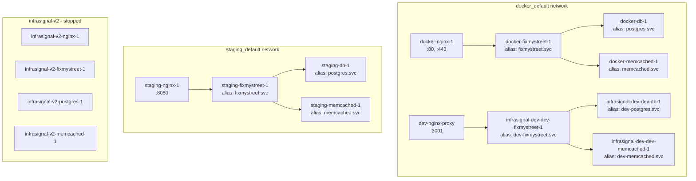
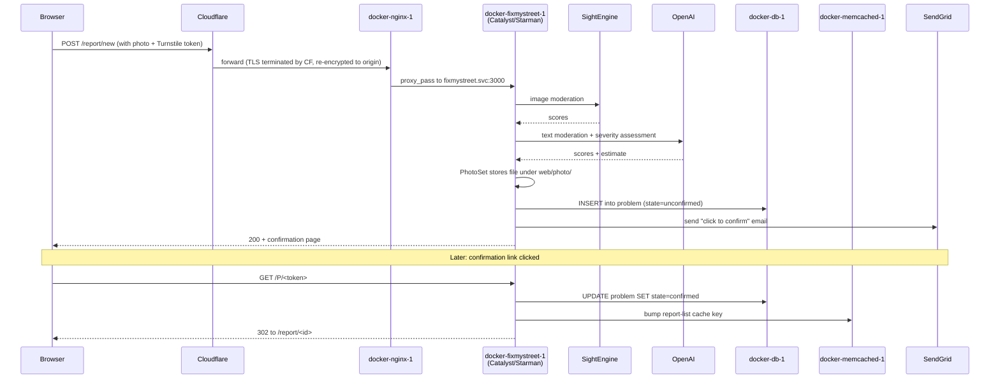

# InfraSignal — System Map

One-stop visual reference for the whole stack: what's running where,
which network it's on, how requests flow, and where to edit what.
Generated 2026-05-27. Mermaid diagrams render in any modern markdown
viewer (GitHub, VS Code, etc).

---

## 1. Bird's-eye view



Three compose projects. One legacy project (`infrasignal-v2`) stopped
but containers + volumes preserved.

---

## 2. Stack comparison

|  | Prod | Staging | Dev |
| --- | --- | --- | --- |
| Public on | `https://infrasignal.org` | `127.0.0.1:8080` (SSH tunnel) | `:3001` |
| Compose project | `docker` | `staging` | `infrasignal-dev` |
| Compose file | `docker/docker-compose-prod.yml` | `docker/docker-compose-staging.yml` | `docker/docker-compose-local.yml` (in `/opt/infrasignal-dev`) |
| Source on disk | `/opt/infrasignal-v2` | `/opt/infrasignal-v2` (same — shared mount) | `/opt/infrasignal-dev` |
| Effective config | `conf/general.yml` | `conf/general.yml-staging.runtime` (override) | `conf/general.yml` (in dev repo) |
| `STAGING_SITE` | 0 | 1 | 1 |
| Network | `docker_default` | `staging_default` (isolated) | joins `docker_default` with distinct aliases |
| Database | own (`docker_fixmystreet-pgdata`) | own (`staging_staging-pgdata`) | own (`infrasignal-dev_dev-pgdata`) — isolated 2026-05-26 |
| Memcached | own | own | own (`dev-memcached.svc`) — isolated 2026-05-26 |
| Sends real reports | yes | yes (against staging DB only) | yes (against dev DB only) |
| Sends real emails | yes (SendGrid) | no | depends on local SMTP |
| Restart policy | always | always | always |
| Deploy script | `bin/deploy` | `bin/staging-deploy` | restart container directly |

---

## 3. Container + network topology



**Notes:**

- Dev and prod share the `docker_default` bridge but use distinct
  aliases (`dev-postgres.svc` vs `postgres.svc`,
  `dev-memcached.svc` vs `memcached.svc`). No cross-talk.
- Same alias `postgres.svc` exists on prod's `docker_default` and
  staging's `staging_default` but resolves locally per-network —
  staging containers never see prod's postgres.
- Legacy stack is fully isolated (own network, all containers
  stopped, volumes preserved).

---

## 4. Request flow: anonymous user submits a report



---

## 5. Where to edit what — cheat-sheet

| If you want to change... | Edit... | Apply with... |
| --- | --- | --- |
| User-facing page text | `templates/web/infrasignal/...html` | `sudo docker restart docker-fixmystreet-1` (live mount) |
| Site CSS / JS | `web/cobrands/infrasignal/...scss` | `bin/make_css`, then nothing else (live mount) |
| InfraSignal business logic | `perllib/FixMyStreet/Cobrand/Infrasignal.pm` | `sudo docker restart docker-fixmystreet-1` |
| Photo upload behaviour | `perllib/FixMyStreet/App/Model/PhotoSet.pm` | `sudo docker restart docker-fixmystreet-1` |
| Photo moderation | `perllib/FixMyStreet/SightEngine.pm` | `sudo docker restart docker-fixmystreet-1` |
| nginx routing / security headers (prod) | `conf/nginx.conf-prod` | `sudo docker exec docker-nginx-1 nginx -t && sudo docker exec docker-nginx-1 nginx -s reload` |
| nginx healthcheck or container resources | `docker/docker-compose-prod.yml` | `sudo docker compose -p docker -f docker/docker-compose-prod.yml --env-file docker/.env up -d --no-deps nginx` |
| API keys / SMTP / DB passwords | `conf/general.yml` (gitignored) and/or `.env` | `sudo docker restart docker-fixmystreet-1` |
| Add a public form | template + cobrand allowed routes | restart fixmystreet |
| Add a new DB column | new `db/schema_NNNN-*.sql` | `sudo docker exec docker-fixmystreet-1 bin/update-schema --commit` |
| Branch policy / deploy procedure | `bin/deploy`, `ARCHITECTURE.md` | nothing to apply |
| Staging configuration | `conf/general.yml-staging` (template) | `sudo bin/staging-deploy --regen` then restart staging-fixmystreet |
| Image-based prod (when ready) | `docker/docker-compose-prod-image.yml` | `IMAGE_TAG=<sha> sudo docker compose -p docker -f docker/docker-compose-prod-image.yml --env-file docker/.env up -d` |
| Dev's DB / memcached | `/opt/infrasignal-dev/docker/docker-compose-local.yml` + `/opt/infrasignal-dev/conf/general.yml` | `sudo docker compose -p infrasignal-dev up -d` then restart dev-fixmystreet |

---

## 6. Filesystem layout (high level)

```
/opt/
├── infrasignal-v2/                  ← PROD source tree (bind-mounted into docker-fixmystreet-1)
│   ├── conf/
│   │   ├── general.yml              ← prod runtime config (gitignored; has secrets)
│   │   ├── general.yml-staging      ← staging template (committed)
│   │   ├── general.yml-staging.runtime ← generated by bin/staging-deploy (gitignored)
│   │   ├── nginx.conf-prod          ← prod nginx (locked to infrasignal.org)
│   │   ├── nginx.conf-docker        ← staging nginx
│   │   ├── nginx-dev-local.conf     ← dev-nginx-proxy nginx
│   │   ├── nginx-main.conf          ← shared main http block
│   │   └── ssl/                     ← infrasignal.org.{pem,key}
│   ├── docker/
│   │   ├── docker-compose-prod.yml          ← ACTIVE prod compose
│   │   ├── docker-compose-prod-image.yml    ← draft image-based prod (not active)
│   │   ├── docker-compose-staging.yml       ← staging compose
│   │   ├── docker-compose-dev.yml           ← FixMyStreet dev compose (unused in this setup)
│   │   ├── docker-compose-test.yml          ← FixMyStreet test compose (unused)
│   │   ├── docker-compose-local.yml         ← FixMyStreet local compose (template for dev's)
│   │   └── .env -> ../.env                  ← POSTGRES_PASSWORD lives in ../.env
│   ├── bin/
│   │   ├── deploy                   ← prod deploy script (BRANCH=${DEPLOY_BRANCH:-dev})
│   │   ├── staging-deploy           ← staging lifecycle script
│   │   ├── backup-db                ← runs from cron at 03:00 UTC
│   │   └── healthcheck              ← runs from cron every 5 min
│   ├── notes/2026-05-26-*.md        ← change logs
│   ├── ARCHITECTURE.md
│   ├── CHANGELOG.md
│   ├── README.md
│   └── SYSTEM-MAP.md                ← this file
│
├── infrasignal-dev/                 ← DEV source tree (bind-mounted into dev-fixmystreet-1)
│   ├── conf/
│   │   ├── general.yml              ← dev runtime config — points at dev-postgres.svc since 2026-05-26
│   │   └── general.yml.pre-isolation-2026-05-26.bak ← backup of pre-isolation config
│   └── docker/
│       └── docker-compose-local.yml ← dev compose (includes dev-db + dev-memcached)
│
└── backups/
    └── infrasignal/                 ← pg_dump output from bin/backup-db
```

---

## 7. Compose project / container map

```
docker (prod):
  docker-nginx-1        nginx:1.27.2          :80/:443 → fixmystreet.svc
  docker-fixmystreet-1  docker-fixmystreet    Catalyst app, Starman on 3000
  docker-db-1           docker-db (pg13.11)   alias postgres.svc
  docker-memcached-1    memcached:1.6.32      alias memcached.svc

staging (staging):
  staging-nginx-1       nginx:1.27.2          127.0.0.1:8080 → fixmystreet.svc
  staging-fixmystreet-1 staging-fixmystreet   same Dockerfile-development as dev
  staging-db-1          staging-db (pg13.11)  own pgdata volume, own network
  staging-memcached-1   memcached:1.6.32

infrasignal-dev (dev):
  infrasignal-dev-dev-fixmystreet-1   infrasignal-dev-dev-fixmystreet
  infrasignal-dev-dev-db-1            infrasignal-dev-dev-db (pg13.11)  ← ADDED 2026-05-26
  infrasignal-dev-dev-memcached-1     memcached:1.6.32                  ← ADDED 2026-05-26
  dev-nginx-proxy                     nginx:1.27.2 (hand-started, :3001)

infrasignal-v2 (legacy, STOPPED):
  infrasignal-v2-nginx-1              restart=no
  infrasignal-v2-fixmystreet-1        restart=no (had been in restart loop)
  infrasignal-v2-postgres-1           restart=no (DB empty)
  infrasignal-v2-memcached-1          restart=no
```

---

## 8. Disaster recovery quick reference

| If this happens... | Do this |
| --- | --- |
| Prod nginx restart fails | Check `conf/nginx.conf-prod` exists; `docker exec docker-nginx-1 nginx -t` |
| Prod fixmystreet won't start | Check `conf/general.yml` has correct `FMS_DB_HOST: postgres.svc` |
| Dev fixmystreet won't start | Check `conf/general.yml` (in dev repo) points at `dev-postgres.svc`; verify dev-db-1 is running |
| Need to roll back a deploy | `cd /opt/infrasignal-v2 && ./bin/deploy --rollback` |
| Need pre-change prod | `git checkout prod-2026-05-03` then `./bin/deploy --quick` |
| Lost dev's general.yml | `cp conf/general.yml.pre-isolation-2026-05-26.bak conf/general.yml` then re-apply isolation edits (3 lines) |
| All compose files missing | Reconstruct via `docker inspect <container>` — see `notes/2026-05-27-restoration-after-desync.md` |
